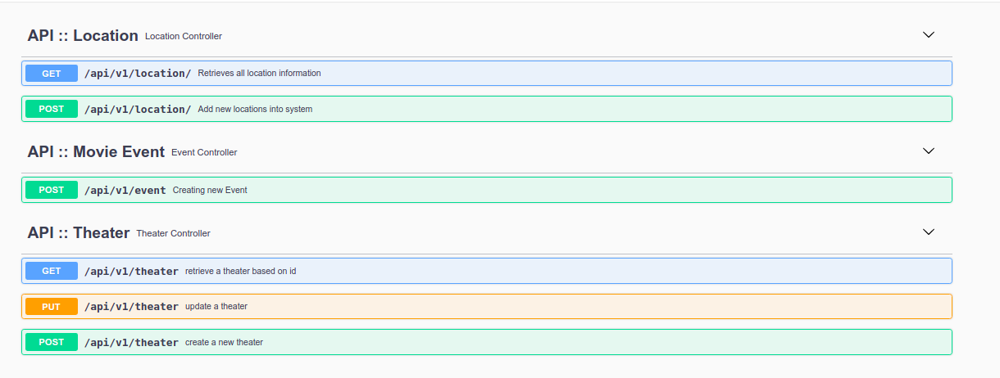
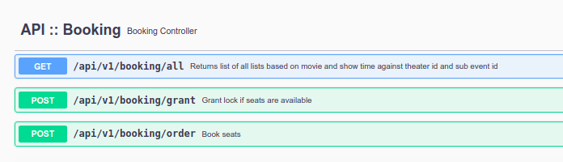

# Movie-Booking-Parents
This is a demo assignment simulating book my show.

## Architecture
 

## Modules
Below modules have been identified as key module. Module description is given below.

|NAME                          |DESCRIPTION                         |
|-------------------------------|-----------------------------|
|movie-store            |Exposes API for movies.            |
|theater-manager        |Exposes API for on boarding Theater into the system          |
|booking-system         |Helps booking tickets|
|transaction-manager    |Handle payments|
|notificaion            |Handle notification|

## Tech Stack

### Pre-requisite 
 - Apache Maven 3.6.2
 - Docker CE
 - Open JDK 8   
   
### Technology Used
 - Java 8
 - Spring Boot 2.4
 - Redis 6.0.13
 - Mongo DB 4.2

  > Docker support is also provided.

## API Documentation

### Service : Movie-Store

### Service : Theater-Manager

### Service : Booking-System

## Testing Evidence
see documentation [here](./Testing.md)

## License

Open Source

**Free for learning!**

