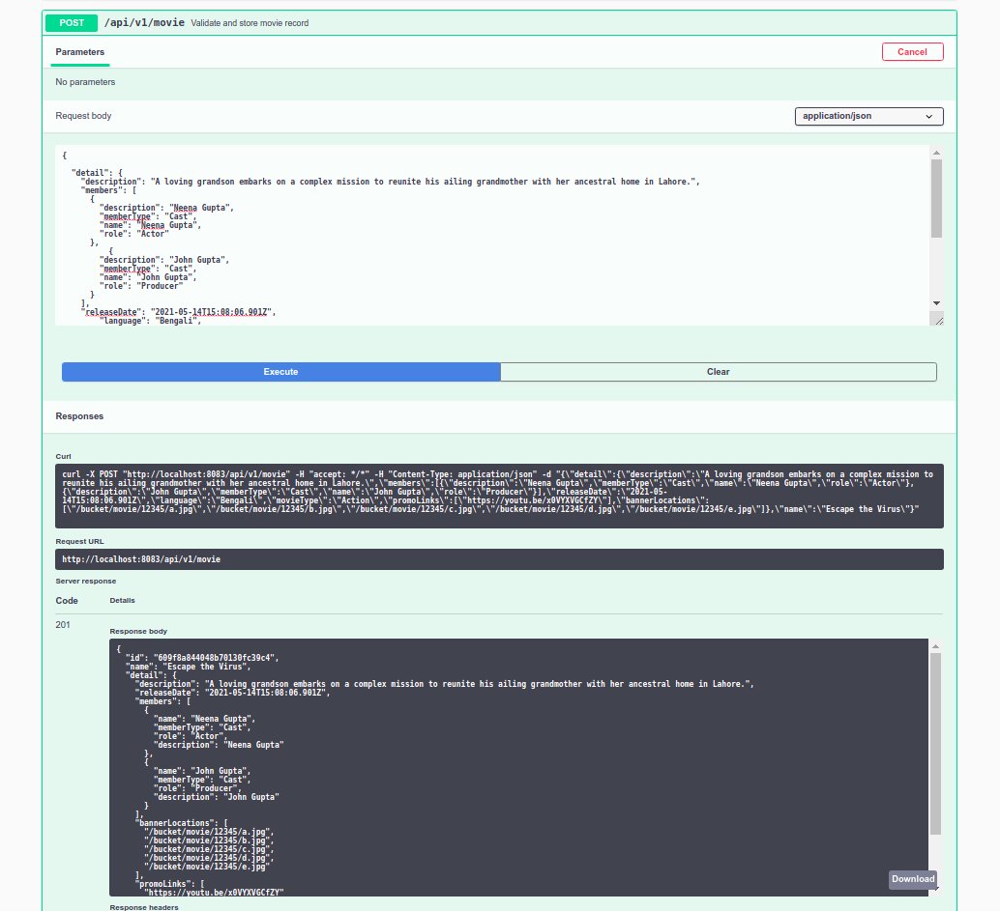
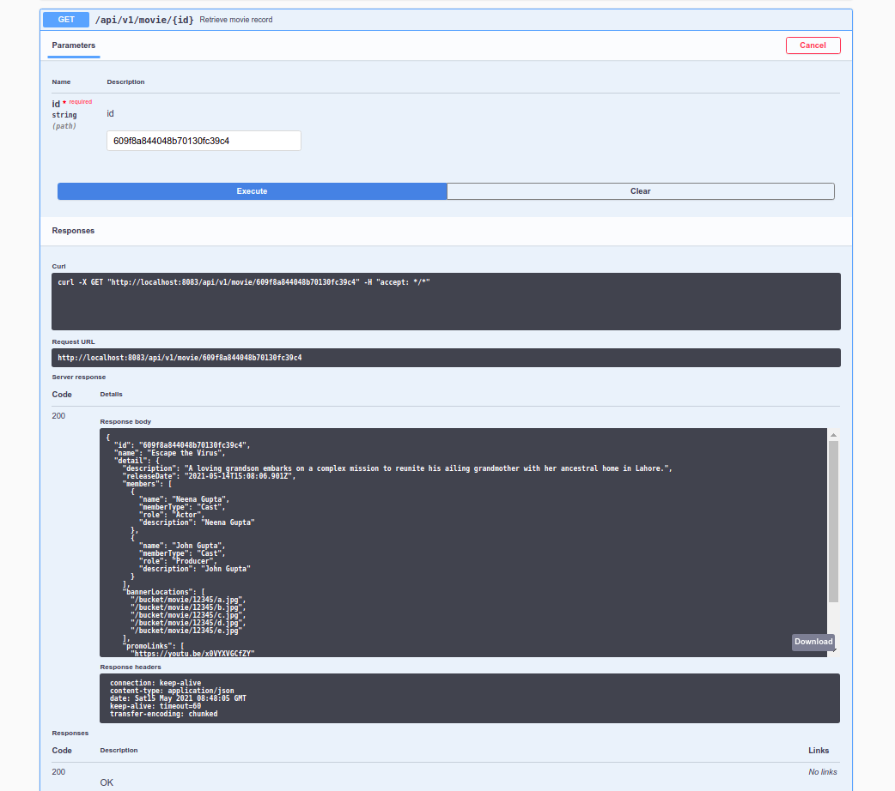
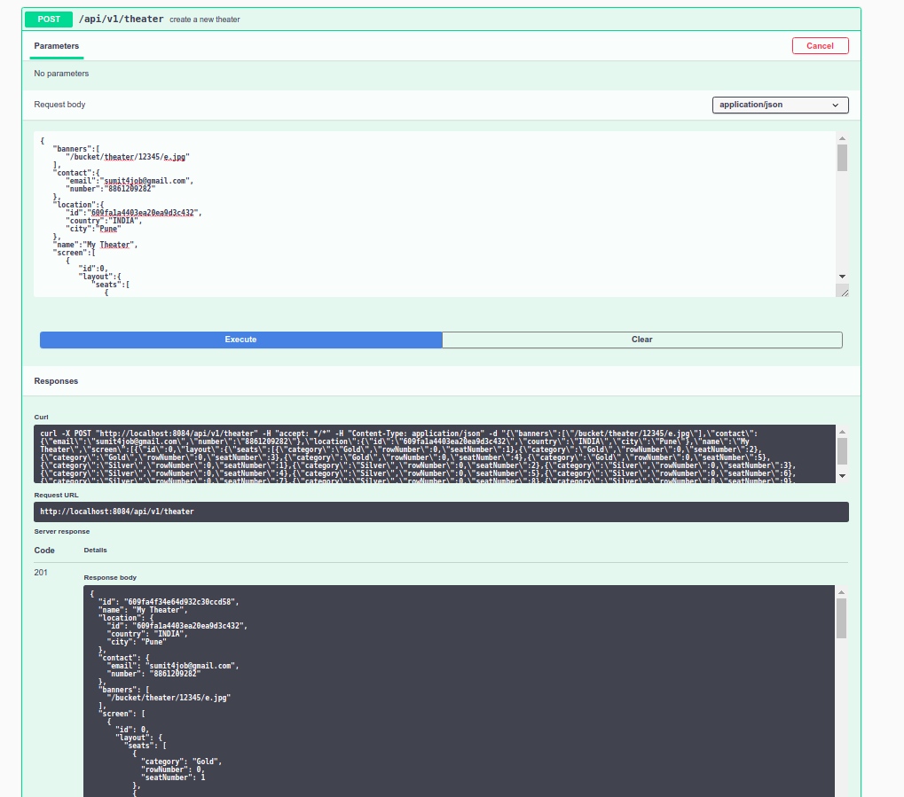
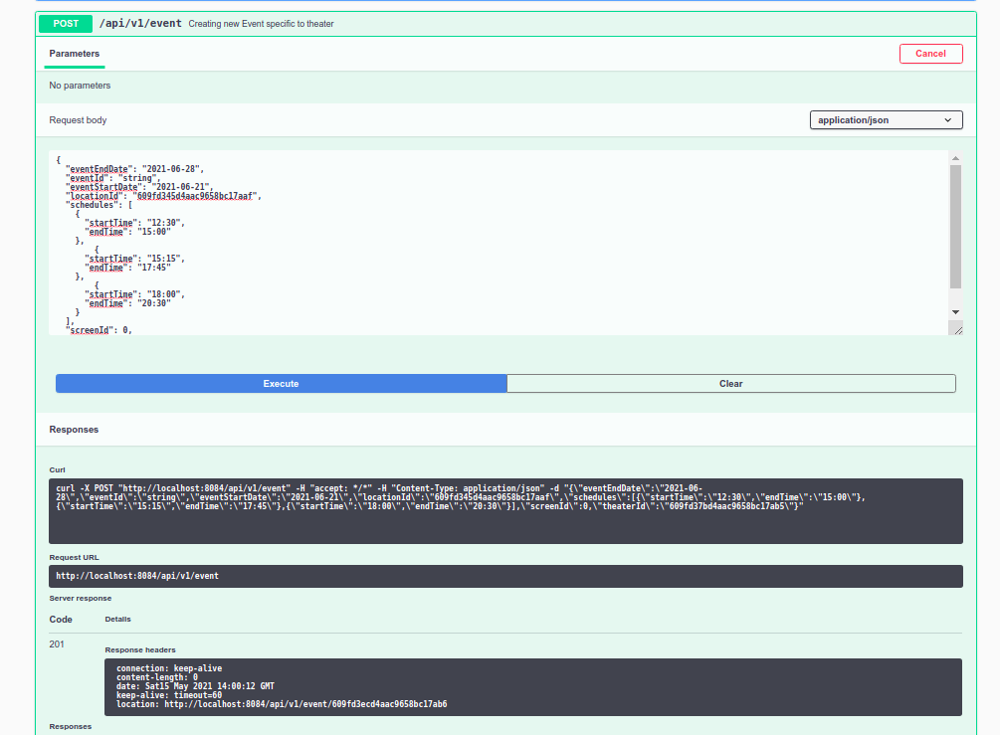
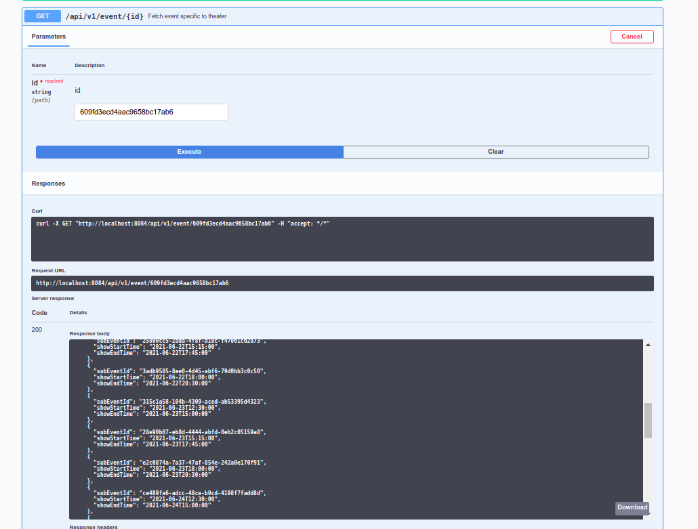
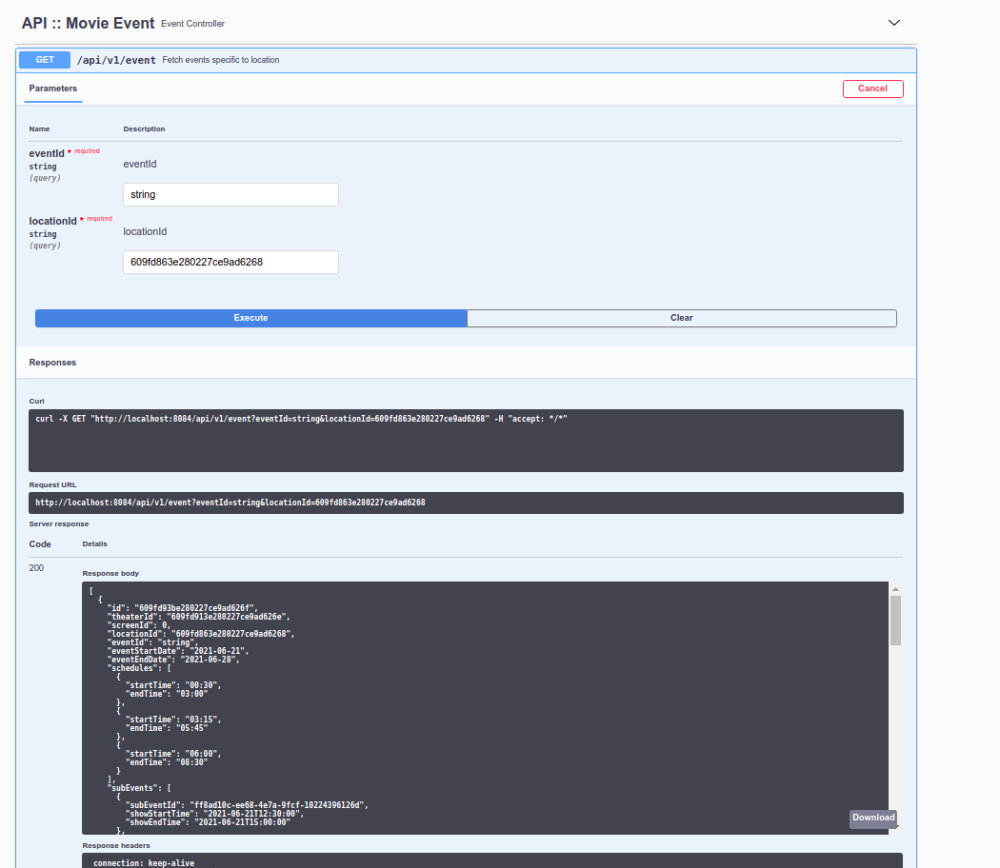

# Testing different component
Module wise testing evidence is attached below
## Movie-Store
 - Creating movie   
      
 - Retrieving Movie   
   
   
## Theater-Manager
 - Onboard theater   
      
 - Onboard movie against theater   
      
 - Verify event with detailed steps has been created or not  
      
 - Search movie based on location and movie id i.e eventId 
      